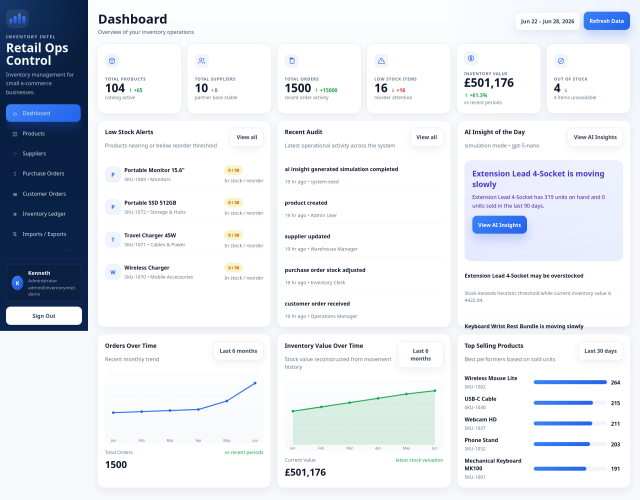
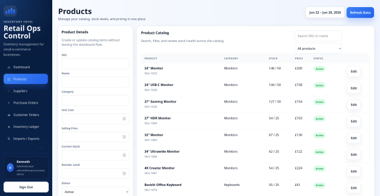
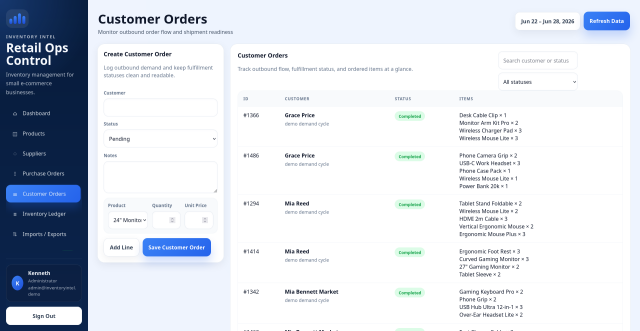
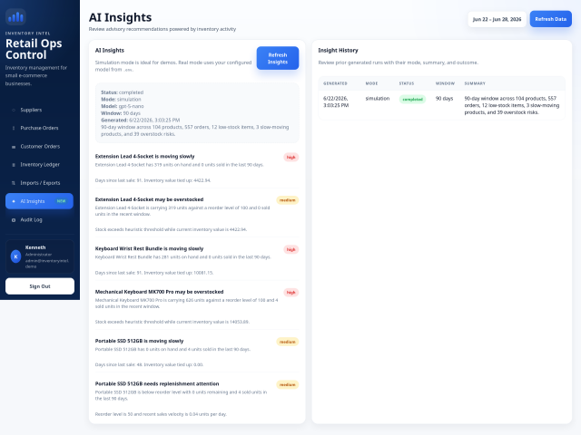
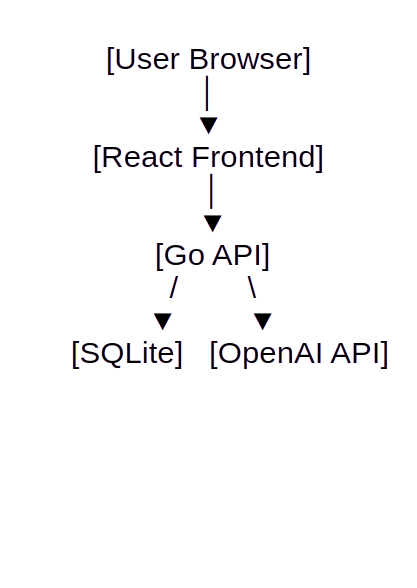

# Inventory Intel

## About

Inventory Intel is a portfolio project demonstrating the design and implementation of inventory and order management software for small retail and e-commerce businesses.

The project focuses on:

- Business workflow automation
- Inventory visibility
- Operational reporting
- AI-assisted decision support

## Screenshots

### Dashboard



### Products



### Customer Orders



### AI Insights




## Features

- Product catalog management
- Inventory tracking and adjustments
- Supplier management
- Purchase order workflows
- Customer order processing
- Inventory ledger
- Dashboard reporting
- CSV import/export
- Audit logging
- AI-powered inventory insights
- Responsive desktop, tablet and mobile layouts

## Technology Stack

### Backend

- Go
- SQLite

### Frontend

- React
- TypeScript
- Tailwind CSS

### AI

- OpenAI Responses API
- GPT-5 Nano

### Deployment

- Docker Compose

### Architecture



## AI Insights

Inventory Intel analyses inventory and order activity to identify:

- Low stock risks
- Overstock situations
- Slow-moving products
- Supplier performance concerns
- Inventory valuation trends

Example insight:

> Extension Lead 4-Socket is moving slowly

> Extension Lead 4-Socket has 319 units on hand and 0 units sold in the last 90 days.
> high
> Days since last sale: 91. Inventory value tied up: 4422.94.


## Demo Account

The MVP includes a single seeded administrator account for testing:

- Email: `admin@inventoryintel.demo`
- Username: `kenneth`
- Password: `DemoAdmin123!`

## Demo Data

The repository includes realistic seed data for:

- Products
- Suppliers
- Purchase Orders
- Customer Orders
- Inventory Transactions
- Audit Logs

This allows the dashboard, reports and AI insights to be demonstrated immediately after installation.

## Getting Started

```bash
cp .env.example .env
go mod tidy
go run ./cmd/inventory-intel
```

Open [http://localhost:8080](http://localhost:8080).

## AI insight configuration

`.env.example` contains the supported settings:

```text
AI_INSIGHTS_MODE=simulation
OPENAI_MODEL=gpt-5-nano
OPENAI_BASE_URL=https://api.openai.com/v1
OPENAI_API_KEY=
```

Notes:
- Leave `AI_INSIGHTS_MODE=simulation` for demo mode.
- Set `AI_INSIGHTS_MODE=real` and provide `OPENAI_API_KEY` to enable live model-backed insights.
- `OPENAI_MODEL` defaults to `gpt-5-nano` and can be changed later without code changes.

## Docker

```bash
docker compose up --build
```

## Roadmap

### MVP
- [x] Products
- [x] Suppliers
- [x] Purchase Orders
- [x] Customer Orders
- [x] Inventory Ledger
- [x] Audit Logging
- [x] AI Insights

### Future Enhancements
- [ ] User roles
- [ ] Multi-location inventory
- [ ] Barcode support
- [ ] Email notifications
- [ ] Demand forecasting
- [ ] Supplier scorecards

## CSV formats

Products header:

```text
sku,name,description,category,unit_cost,selling_price,current_stock,reorder_level,active
```

Suppliers header:

```text
name,contact_name,email,phone,notes
```
